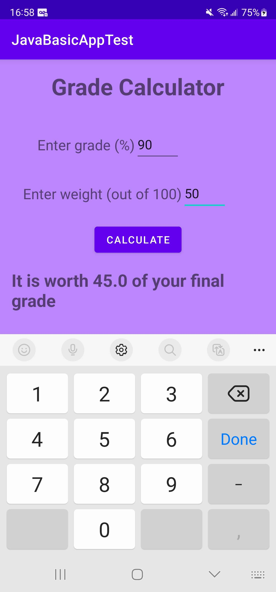

# Basic-App-Test-Java

Using Java and xml I made a basic app used to calculate how much a grade is worth overall based on its weight.

### Versions
[Kotlin](https://github.com/Wavedoo/Basic-App-Test-Kotlin)  
[<b>Java</b>](https://github.com/Wavedoo/Basic-App-Test-Java)

## The process
The app took about half an hour to make due to the fact that I reused xml from the [Kotlin version](https://github.com/Wavedoo/Basic-App-Test-Kotlin)  
Redoing the Kotlin part in Java was simple since it used the same concepts but using Java.  
## Screenshots
<b>No inputs</b>
 

 
<b>All inputs</b>
 

